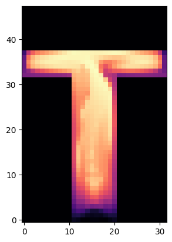

# tum-logo
A cool simulation using the [phiflow](https://github.com/tum-pbs/PhiFlow/ ) differentiable fluid solver.

The obstacles created in the code are numbered according to the legend below. The black boxes denote inflows and the white spaces are empty domain. Same colored boxes are same sized obstacles.

## 2D Version

### Simulation (res:256)

### Learning the T from a blob (res:32)
The simulation starts as a blob with zero buoyancy, with only 20 frames. 

*Simulation before optimization*

The target was generated using a 100-frame simulation at res=32 and dt=0.5

*Target for the blob*

The optimized density after 300 epochs is this.

*Optimized densities*

## 3D Version

The 3D version was rendered using the open-source free software [Blender](https://www.blender.org/). More details on the rendering process and setup soon.