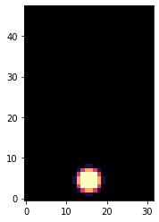

# tum-logo
A cool simulation using the [phiflow](https://github.com/tum-pbs/PhiFlow/ ) differentiable fluid solver.

The obstacles created in the code are numbered according to the legend below. The black boxes denote inflows and the white spaces are empty domain. Same colored boxes are same sized obstacles.

## 2D Version

### Simulation (res:256)

### Learning the T from a blob (res:32)
The initial simulation starts as a blob with zero buoyancy. 

*Simulation before optimization*

The target was generated using a *100-frame simulation* at res=32 and dt=0.5. The optimized density fields for a *30-frame simulation* were obtained after training for 300 epochs.

 

### Learning the TUM from 3 blobs

Learning the whole TUM proved to be much more difficult. As a target, an image of the logo was used. It was converted to a numpy array in python. An effort has been made for three different resolutions. The current results are shown below.

#### Res: 16x24

#### Res: 32x48

#### Res: 64x96

It seems that the higher the resolution, the better the optimization can approximate the target, but also the computational cost increases significantly.

## 3D Version

The 3D version was rendered using the open-source free software [Blender](https://www.blender.org/). More details on the rendering process and setup soon.